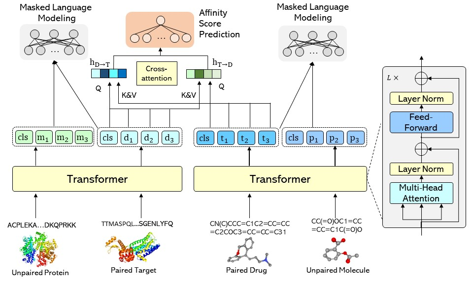

# SMT-DTA: Improving Drug-Target Affinity Prediction with Semi-supervised Multi-task Training

This repository contains the code and data link for [SMT-DTA: Improving Drug-Target Affinity Prediction with Semi-supervised Multi-task Training](https://arxiv.org/abs/2206.09818). Our model achieves significant results compared to traditional and recent baselines. We implement our method based on the codebase of [fairseq](https://github.com/pytorch/fairseq). If you have questions, don't hesitate to open an issue or ask me via <peiqz@mail.ustc.edu.cn> or Lijun Wu via <lijuwu@microsoft.com>. We are happy to hear from you!

## Model Architecture



## Requirements and Installation
* Python version == 3.7
* PyTorch version == 1.10.2
* Fairseq version == 0.10.2
* RDKit version == 2020.09.5
* numpy

We will set up the environment using conda. Clone the current repo and fairseq official repo, then merge them:

```shell
# Need to modify url when public
git clone https://github.com/QizhiPei/SMT-DTA.git
cd SMT-DTA
pwd=$PWD

git clone git@github.com:pytorch/fairseq.git /tmp/fairseq
cd /tmp/fairseq
git checkout v0.10.2

cd $pwd
cp -r -n /tmp/fairseq/* ./
```
Create a new environment: 

```shell
conda create -n fairseq-smt-dta python=3.7
```

Activate the environment:

```shell
conda activate fairseq-smt-dta
```

Install required packages for evaluation:

```shell
conda install -c conda-forge rdkit
pip install future scipy sklearn lifelines requests
```

Install the code from source:

```shell
pip install -e . 
```

## Dataset

* Unlabeled Molecule and Protein
  * Pfam: http://ftp.ebi.ac.uk/pub/databases/Pfam/current_release/
  * PubChem: https://ftp.ncbi.nlm.nih.gov/pubchem/Compound/CURRENT-Full/SDF/
* BindingDB Dataset: https://github.com/Shen-Lab/DeepAffinity/tree/master/data/dataset

## Getting Started

### Data Preprocessing

#### Unlabeled Molecule and Protein

```shell
DATADIR=/yourUnlabeledDataDir
DATA_BIN=/yourDataBinDir

# Canonicalize all SMILES
python preprocess/canonicalize.py $DATADIR/train.mol --workers 40 \
  --output-fn $DATADIR/train.mol.can

# Tokenize all SMILES
python preprocess/tokenize_re.py $DATADIR/train.mol.can --workers 40 \
  --output-fn $DATADIR/train.mol.can.re 

# Tokenize all protein sequence
python preprocess/add_space.py $DATADIR/train.pro --workers 40 \
  --output-fn $DATADIR/train.pro.addspace

# You should also canonicalize and tokenize the valid set in the same way.

# Binarize the data
fairseq-preprocess \
    --only-source \
    --trainpref $DATADIR/train.mol.can.re \
    --validpref $DATADIR/valid.mol.can.re \
    --destdir $DATA_BIN/molecule \
    --workers 40 \
    --srcdict preprocess/dict.mol.txt
    
fairseq-preprocess \
    --only-source \
    --trainpref $DATADIR/train.pro.addspace \
    --validpref $DATADIR/valid.pro.addspace \
    --destdir $DATA_BIN/protein \
    --workers 40 \
    --srcdict preprocess/dict.pro.txt
```
#### Paired DTA data

You may need to firstly follow the README in `preprocess` folder to process the data from `BindingDB_All.tsv`.

```shell
DATADIR=/yourPairedDataDir
DATA_BIN=/yourDataBinDir/bindingdb(davis or kiba)

# Canonicalize all SMILES
python preprocess/canonicalize.py $DATADIR/train.mol --workers 40 \
  --output-fn $DATADIR/train.mol.can

# Tokenize all SMILES
python preprocess/tokenize_re.py $DATADIR/train.mol.can --workers 40 \
  --output-fn $DATADIR/train.mol.can.re 

# Tokenize all protein sequence
python preprocess/add_space.py $DATADIR/train.pro --workers 40 \
  --output-fn $DATADIR/train.pro.addspace

# You should also process the valid set and test set in the same way.

# Binarize the data
fairseq-preprocess \
    --only-source \
    --trainpref $DATADIR/train.mol.can.re \
    --validpref $DATADIR/valid.mol.can.re \
    --destdir $DATA_BIN/input0 \
    --workers 40 \
    --srcdict preprocess/dict.mol.txt

fairseq-preprocess \
    --only-source \
    --trainpref $DATADIR/train.pro.addspace \
    --validpref $DATADIR/valid.pro.addspace \
    --destdir $DATA_BIN/input1 \
    --workers 40 \
    --srcdict preprocess/dict.pro.txt

mkdir -p $DATA_BIN/label

cp $DATADIR/train.label $DATA_BIN/label/train.label
cp $DATADIR/valid.label $DATA_BIN/label/valid.label
```

### Train Baseline

```shell
DATA_BIN=/yourDataBinDir/bindingdb(davis or kiba)  
FAIRSEQ=$pwd # The path to 
SAVE_PATH=/yourCkptDir
TOTAL_UPDATES=200000 # Total number of training steps
WARMUP_UPDATES=10000 # Warmup the learning rate over this many updates
PEAK_LR=0.00005       # Peak learning rate, adjust as needed
BATCH_SIZE=4		# Batch size
UPDATE_FREQ=4       # Increase the batch size 4x

mkdir -p $SAVE_PATH

python $FAIRSEQ/train.py --task dti_separate $DATA_BIN \
    --num-classes 1 --init-token 0 \
    --max-positions-molecule 512 --max-positions-protein 1024 \
    --save-dir $SAVE_PATH \
    --encoder-layers 12 \
    --criterion dti_separate --regression-target \
    --batch-size $BATCH_SIZE --update-freq $UPDATE_FREQ --required-batch-size-multiple 1 \
    --optimizer adam --weight-decay 0.1 --adam-betas '(0.9,0.98)' --adam-eps 1e-06 \
    --lr-scheduler polynomial_decay --lr $PEAK_LR --warmup-updates $WARMUP_UPDATES --total-num-update $TOTAL_UPDATES \
    --clip-norm 1.0  --max-update $TOTAL_UPDATES \
    --arch roberta_dti_cross_attn --dropout 0.1 --attention-dropout 0.1 \
    --skip-invalid-size-inputs-valid-test \
    --fp16 \
    --shorten-method truncate \
    --find-unused-parameters | tee -a ${SAVE_PATH}/training.log
```

* `DATA_BIN` is where you save the preprocessed data
* `FAIRSEQ` is the path to fairseq code base
* `SAVE_PATH` is where you save the checkpoint file and training log

### Train SMT-DTA Model

```shell
DATA_BIN=/yourDataBinDir
DTA_DATASET=bindingdb(davis or kiba)
FAIRSEQ=$pwd
SAVE_PATH=/yourCkptDir
TOTAL_UPDATES=200000 # Total number of training steps
INTERVAL_UPDATES=1000 # Validate and save checkpoint every N updates
WARMUP_UPDATES=10000 # Warmup the learning rate over this many updates
PEAK_LR=0.0001       # Peak learning rate, adjust as needed
BATCH_SIZE=4		# Batch size
UPDATE_FREQ=8       # Increase the batch size 8x
MLMW=2 				# MLM loss weight

# The final real batch size is BATCH_SIZE x GPU_NUM x UPDATE_FREQ

mkdir -p $SAVE_PATH

python $FAIRSEQ/train.py --task dti_mlm_regress_pretrain $DATA_BIN \
	--dti-dataset $DTA_DATASET \
    --num-classes 1 --init-token 0 \
    --max-positions-molecule 512 --max-positions-protein 1024 \
    --save-dir $SAVE_PATH \
    --encoder-layers 12 \
    --criterion dti_mlm_regress_pretrain --regression-target \
    --batch-size $BATCH_SIZE --update-freq $UPDATE_FREQ --required-batch-size-multiple 1 \
    --optimizer adam --weight-decay 0.01 --adam-betas '(0.9,0.98)' --adam-eps 1e-06 \
    --lr-scheduler polynomial_decay --lr $PEAK_LR --warmup-updates $WARMUP_UPDATES --total-num-update $TOTAL_UPDATES \
    --clip-norm 1.0  --max-update $TOTAL_UPDATES \
    --arch roberta_dti_cross_attn --dropout 0.1 --attention-dropout 0.1 \
    --skip-invalid-size-inputs-valid-test \
    --fp16 \
    --shorten-method truncate \
    --use-2-attention --find-unused-parameters --ddp-backend no_c10d \
    --validate-interval-updates $INTERVAL_UPDATES \
    --save-interval-updates $INTERVAL_UPDATES \
    --best-checkpoint-metric loss_regress_mse \
    --mlm-weight-0 $MLMW --mlm-weight-1 $MLMW --mlm-weight-paired-0 $MLMW --mlm-weight-paired-1 $MLMW | tee -a ${SAVE_PATH}/training.log
```
* `DATA_BIN` is where you save the preprocessed data
* `DTA_DATASET` is the paired dataset you want to use for training
* `FAIRSEQ` is the path to fairseq code base
* `SAVE_PATH` is where you save the checkpoint file and training log

You can also use fairseq argument `--tensorboard-logdir TENSORBOARD_LOGDIR`  to save logs for tensorboard.

## Evaluation

```shell
# Copy dict to DATA_BIN for evaluation
cp preprocess/dict.mol.txt $DATA_BIN
cp preprocess/dict.pro.txt $DATA_BIN

python $FAIRSEQ/test.py \
	--checkpoint yourCheckpointFilePath \
	--data-bin $DATA_BIN \
	--test-data yourTestSetDirPath \
	--output-fn yourResultFilePath
```

* `DATA_BIN` is where you save the preprocessed data. We need to use the dictionary saved in this path.
* `yourCheckpointFilePath` is the path to `.pt` file
* `yourTestSetDirPath` is the path to your raw test data after tokenized (and canonicalized)
* `yourResultFilePath` is where you want to save the model prediction and ground truth

## Feature-based Training/Finetune

For feature-based training(only use the output from the pretrained molecule and protein encoder but not update their parameter) or finetune, you need to prepare your pretrained checkpoint files in the fairseq format. Use these checkpoint files to initialize your molecule and protein encoder, respectively. The code file `fairseq/models/dti_mlm_regress_sep_encoder_from_pretrained_roberta.py` is provided for reference.

To fix the encoder, you can just add the following code in your model class:

```python
for param in encoder_molecule.parameters():
	param.requires_grad = False
for param in encoder_protein.parameters():
	param.requires_grad = False
```

## Citation

If you find our code is helpful for you, please consider citing our paper:

```
@misc{https://doi.org/10.48550/arxiv.2206.09818,
  doi = {10.48550/ARXIV.2206.09818},
  url = {https://arxiv.org/abs/2206.09818},
  author = {Pei, Qizhi and Wu, Lijun and Zhu, Jinhua and Xia, Yingce and Xie, Shufang and Qin, Tao and Liu, Haiguang and Liu, Tie-Yan},
  keywords = {Biomolecules (q-bio.BM), Artificial Intelligence (cs.AI), Machine Learning (cs.LG), FOS: Biological sciences, FOS: Biological sciences, FOS: Computer and information sciences, FOS: Computer and information sciences},
  title = {SMT-DTA: Improving Drug-Target Affinity Prediction with Semi-supervised Multi-task Training},
  publisher = {arXiv},
  year = {2022},
  copyright = {arXiv.org perpetual, non-exclusive license}
}
```

## License

This project is licensed under the terms of the MIT license. See [LICENSE](https://github.com/QizhiPei/SMT-DTA/blob/main/LICENSE) for additional details.

## Contacts

Qizhi Pei: peiqz@mail.ustc.edu.cn

Lijun Wu: lijuwu@microsoft.com
