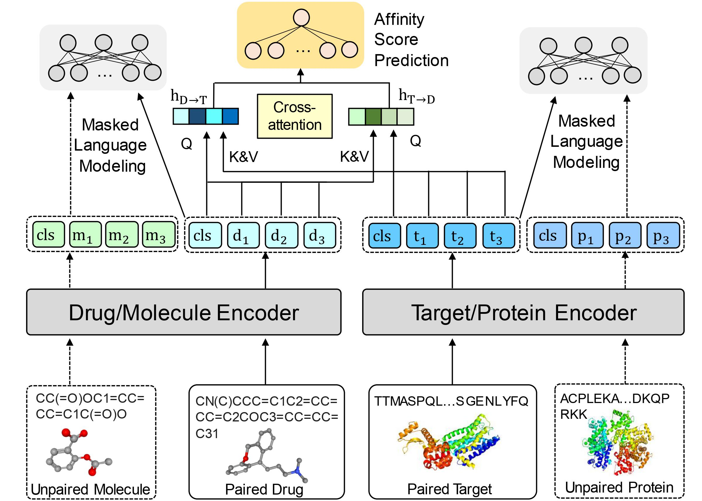

<h1 align="center">
SSM-DTA: Breaking the Barriers of Data Scarcity in Drug-Target Affinity Prediction 🔥
</h1>

<div align="center">

[](https://doi.org/10.1093/bib/bbad386)
[](https://arxiv.org/abs/2206.09818)
[](https://github.com/QizhiPei/SSM-DTA)
[](https://pytorch.org/get-started/locally/)

</div>

## Overview

Authors: Qizhi Pei, Lijun Wu, Jinhua Zhu, Yingce Xia, Shufang Xie, Tao Qin, Haiguang Liu, Tie-Yan Liu, Rui Yan

This repository contains the code and data link for *Briefings in Bioinformatics 2023* paper [SSM-DTA: Breaking the Barriers of Data Scarcity in Drug-Target Affinity Prediction](https://academic.oup.com/bib/article/24/6/bbad386/7333673). Our model achieves significant results compared to traditional and recent baselines. We implement our method based on the codebase of [fairseq](https://github.com/pytorch/fairseq). If you have questions, don't hesitate to open an issue or ask me via <qizhipei@ruc.edu.cn> or Lijun Wu via <lijun_wu@outlook.com>. We are happy to hear from you!

## News
**Jan 17 2024**: 🔥Update infer script and README for convenient usage~

**Oct 6 2023**: Accepted by Briefings in Bioinformatics. Rename **SMT-DTA** to **SSM-DTA**.

**Oct 22 2022**: Pre-trained data is released.

**Oct 21 2022**: Pre-trained models are released. You can directly test our pre-trained model by our inference scripts.

## SSM-DTA's Data

There are total 4 paired datasets and 2 unlabeled datasets. Please refer to our paper for more details

### Preprocessed Paired Datasets

| Dataset        | File Path in Shared Folder | Update Date  | Download Link                                                |
| -------------- | -------------------------- | ------------ | ------------------------------------------------------------ |
| BindingDB IC50 | BindingDB_IC50.tar.gz      | Oct 22, 2022 | https://mailustceducn-my.sharepoint.com/:f:/g/personal/peiqz_mail_ustc_edu_cn/El98p8TwBh5LhCEoUKI6Yj0BZaWpv0b_sSIAYLLksUlnSA?e=zkvCpQ |
| BindingDB Ki   | BindingDB_Ki.tar.gz        | Oct 22, 2022 | https://mailustceducn-my.sharepoint.com/:f:/g/personal/peiqz_mail_ustc_edu_cn/El98p8TwBh5LhCEoUKI6Yj0BZaWpv0b_sSIAYLLksUlnSA?e=zkvCpQ |
| KIBA           | KIBA.tar.gz                | Oct 22, 2022 | https://mailustceducn-my.sharepoint.com/:f:/g/personal/peiqz_mail_ustc_edu_cn/El98p8TwBh5LhCEoUKI6Yj0BZaWpv0b_sSIAYLLksUlnSA?e=zkvCpQ |
| DAVIS          | DAVIS.tar.gz               | Oct 22, 2022 | https://mailustceducn-my.sharepoint.com/:f:/g/personal/peiqz_mail_ustc_edu_cn/El98p8TwBh5LhCEoUKI6Yj0BZaWpv0b_sSIAYLLksUlnSA?e=zkvCpQ |

### Preprocessed Unlabeled Datasets

| Dataset     | File Path in Shared Folder | Update Date  | Download Link                                                |
| ----------- | -------------------------- | ------------ | ------------------------------------------------------------ |
| PubChem 10M | molecule.tar.gz            | Oct 22, 2022 | https://mailustceducn-my.sharepoint.com/:f:/g/personal/peiqz_mail_ustc_edu_cn/El98p8TwBh5LhCEoUKI6Yj0BZaWpv0b_sSIAYLLksUlnSA?e=zkvCpQ |
| Pfam 10M    | protein.tar.gz             | Oct 22, 2022 | https://mailustceducn-my.sharepoint.com/:f:/g/personal/peiqz_mail_ustc_edu_cn/El98p8TwBh5LhCEoUKI6Yj0BZaWpv0b_sSIAYLLksUlnSA?e=zkvCpQ |

### Data Folder Format

Take the BindingDB_IC50 data for example, the processed data folder should be organized in the following format:

```
DATA_BIN
  |-BindingDB_IC50 # This folder name should be the same as --dti-dataset argument
    |-input0
    |-input1
    |-label
  |-molecule 
  |-protein
```

## SSM-DTA Pre-trained Model Checkpoints

| Model          | File Path in Shared Folder                 | Update Data  | Download Link                                                |
| -------------- | ------------------------------------------ | ------------ | ------------------------------------------------------------ |
| BindingDB IC50 | BindingDB_IC50/checkpoint_best_20221021.pt | Oct 21, 2022 | https://mailustceducn-my.sharepoint.com/:f:/g/personal/peiqz_mail_ustc_edu_cn/EluW1t5l25RFluRkBkPS3jABueKqxPhxIesJJHc7IE3vdw?e=2e88A3 |
| BindingDB Ki   | BindingDB_Ki/checkpoint_best_20221021.pt   | Oct 21, 2022 | https://mailustceducn-my.sharepoint.com/:f:/g/personal/peiqz_mail_ustc_edu_cn/EluW1t5l25RFluRkBkPS3jABueKqxPhxIesJJHc7IE3vdw?e=2e88A3 |
| KIBA           | KIBA/checkpoint_best_20221021.pt           | Oct 21, 2022 | https://mailustceducn-my.sharepoint.com/:f:/g/personal/peiqz_mail_ustc_edu_cn/EluW1t5l25RFluRkBkPS3jABueKqxPhxIesJJHc7IE3vdw?e=2e88A3 |
| DAVIS          | DAVIS/checkpoint_best_20221021.pt          | Oct 21, 2022 | https://mailustceducn-my.sharepoint.com/:f:/g/personal/peiqz_mail_ustc_edu_cn/EluW1t5l25RFluRkBkPS3jABueKqxPhxIesJJHc7IE3vdw?e=2e88A3 |


## Model Architecture



## Requirements and Installation
* Python version == 3.7
* PyTorch version == 1.10.2
* Fairseq version == 0.10.2
* RDKit version == 2020.09.5
* numpy

Note that the above requirements is not strict.
We set up the environment using conda. Clone the current repo and fairseq official repo, then merge them:

```shell
git clone https://github.com/QizhiPei/SSM-DTA.git
cd SSM-DTA
pwd=$PWD

git clone git@github.com:pytorch/fairseq.git /tmp/fairseq
cd /tmp/fairseq
git checkout v0.10.2

cd $pwd
cp -r -n /tmp/fairseq/* ./
```
Create a new environment: 

```shell
conda create -n py37-dta python=3.7
```

Activate the environment:

```shell
conda activate py37-dta
```

Install required packages for evaluation:

```shell
pip install future scipy scikit-learn lifelines requests rdkit==2020.09.5
```

Install the code from source:

```shell
pip install -e . 
```

## Raw Dataset

* We collected and randomly sample the unlabeled molecule and protein data from the following public database:
  * Pfam: [pfamseq.gz file](http://ftp.ebi.ac.uk/pub/databases/Pfam/current_release/pfamseq.gz)
  * PubChem:
  
    * Extract the SMILES from the .sdf file from [PubChem ftp SDF](https://ftp.ncbi.nlm.nih.gov/pubchem/Compound/CURRENT-Full/SDF/)
  
    * Or [PubChem CID-SMILES file](https://ftp.ncbi.nlm.nih.gov/pubchem/Compound/Extras/CID-SMILES.gz)
* BindingDB Dataset: https://github.com/Shen-Lab/DeepAffinity/tree/master/data/dataset
* DAVIS and KIBA Datasets: https://github.com/kexinhuang12345/DeepPurpose

## Getting Started

### Data Preprocessing

#### Unlabeled Molecule and Protein

```shell
DATADIR=/yourUnlabeledDataDir
DATA_BIN=/yourDataBinDir

# Canonicalize all SMILES
python preprocess/canonicalize.py $DATADIR/train.mol --workers 40 \
  --output-fn $DATADIR/train.mol.can

# Tokenize all SMILES
python preprocess/tokenize_re.py $DATADIR/train.mol.can --workers 40 \
  --output-fn $DATADIR/train.mol.can.re 

# Tokenize all protein sequence
python preprocess/add_space.py $DATADIR/train.pro --workers 40 \
  --output-fn $DATADIR/train.pro.addspace

# You should also canonicalize and tokenize the valid set in the same way.

# Binarize the data
fairseq-preprocess \
    --only-source \
    --trainpref $DATADIR/train.mol.can.re \
    --validpref $DATADIR/valid.mol.can.re \
    --destdir $DATA_BIN/molecule \
    --workers 40 \
    --srcdict preprocess/dict.mol.txt
    
fairseq-preprocess \
    --only-source \
    --trainpref $DATADIR/train.pro.addspace \
    --validpref $DATADIR/valid.pro.addspace \
    --destdir $DATA_BIN/protein \
    --workers 40 \
    --srcdict preprocess/dict.pro.txt
```
#### Paired DTA data

You may need to firstly follow the README in `preprocess` folder to process the data from `BindingDB_All.tsv` and downloaded DAVIS and KIBA datasets from Deeppurpose.

```shell
DATADIR=/yourPairedDataDir
DATA_BIN=/yourDataBinDir/bindingdb(davis or kiba)

# Canonicalize all SMILES
python preprocess/canonicalize.py $DATADIR/train.mol --workers 40 \
  --output-fn $DATADIR/train.mol.can

# Tokenize all SMILES
python preprocess/tokenize_re.py $DATADIR/train.mol.can --workers 40 \
  --output-fn $DATADIR/train.mol.can.re 

# Tokenize all protein sequence
python preprocess/add_space.py $DATADIR/train.pro --workers 40 \
  --output-fn $DATADIR/train.pro.addspace

# You should also process the valid set and test set in the same way.

# Binarize the data
fairseq-preprocess \
    --only-source \
    --trainpref $DATADIR/train.mol.can.re \
    --validpref $DATADIR/valid.mol.can.re \
    --testpref $DATADIR/test.mol.can.re \
    --destdir $DATA_BIN/input0 \
    --workers 40 \
    --srcdict preprocess/dict.mol.txt

fairseq-preprocess \
    --only-source \
    --trainpref $DATADIR/train.pro.addspace \
    --validpref $DATADIR/valid.pro.addspace \
    --testpref $DATADIR/test.pro.addspace \
    --destdir $DATA_BIN/input1 \
    --workers 40 \
    --srcdict preprocess/dict.pro.txt

mkdir -p $DATA_BIN/label

cp $DATADIR/train.label $DATA_BIN/label/train.label
cp $DATADIR/valid.label $DATA_BIN/label/valid.label
```

### Train Baseline

```shell
DATA_BIN=/yourDataBinDir/bindingdb(davis or kiba)  
FAIRSEQ=$pwd # The path to 
SAVE_PATH=/yourCkptDir
TOTAL_UPDATES=200000 # Total number of training steps
WARMUP_UPDATES=10000 # Warmup the learning rate over this many updates
PEAK_LR=0.00005       # Peak learning rate, adjust as needed
BATCH_SIZE=4		# Batch size
UPDATE_FREQ=4       # Increase the batch size 4x

mkdir -p $SAVE_PATH

python $FAIRSEQ/train.py --task dti_separate $DATA_BIN \
    --num-classes 1 --init-token 0 \
    --max-positions-molecule 512 --max-positions-protein 1024 \
    --save-dir $SAVE_PATH \
    --encoder-layers 12 \
    --criterion dti_separate --regression-target \
    --batch-size $BATCH_SIZE --update-freq $UPDATE_FREQ --required-batch-size-multiple 1 \
    --optimizer adam --weight-decay 0.1 --adam-betas '(0.9,0.98)' --adam-eps 1e-06 \
    --lr-scheduler polynomial_decay --lr $PEAK_LR --warmup-updates $WARMUP_UPDATES --total-num-update $TOTAL_UPDATES \
    --clip-norm 1.0  --max-update $TOTAL_UPDATES \
    --arch roberta_dti_cross_attn --dropout 0.1 --attention-dropout 0.1 \
    --skip-invalid-size-inputs-valid-test \
    --fp16 \
    --shorten-method truncate \
    --find-unused-parameters | tee -a ${SAVE_PATH}/training.log
```

* `DATA_BIN` is where you save the preprocessed data
* `FAIRSEQ` is the path to fairseq code base
* `SAVE_PATH` is where you save the checkpoint file and training log

### Train SSM-DTA Model

```shell
DATA_BIN=/yourDataBinDir
DTA_DATASET=BindingDB_IC50(or BindingDB_Ki or DAVIS or KIBA)
FAIRSEQ=$pwd
SAVE_PATH=/yourCkptDir
TOTAL_UPDATES=200000 # Total number of training steps
INTERVAL_UPDATES=1000 # Validate and save checkpoint every N updates
WARMUP_UPDATES=10000 # Warmup the learning rate over this many updates
PEAK_LR=0.0001       # Peak learning rate, adjust as needed
BATCH_SIZE=4		# Batch size
UPDATE_FREQ=8       # Increase the batch size 8x
MLMW=2 				# MLM loss weight

# The final real batch size is BATCH_SIZE x GPU_NUM x UPDATE_FREQ

mkdir -p $SAVE_PATH

python $FAIRSEQ/train.py --task dti_mlm_regress_pretrain $DATA_BIN \
	--dti-dataset $DTA_DATASET \
    --num-classes 1 --init-token 0 \
    --max-positions-molecule 512 --max-positions-protein 1024 \
    --save-dir $SAVE_PATH \
    --encoder-layers 12 \
    --criterion dti_mlm_regress_pretrain --regression-target \
    --batch-size $BATCH_SIZE --update-freq $UPDATE_FREQ --required-batch-size-multiple 1 \
    --optimizer adam --weight-decay 0.01 --adam-betas '(0.9,0.98)' --adam-eps 1e-06 \
    --lr-scheduler polynomial_decay --lr $PEAK_LR --warmup-updates $WARMUP_UPDATES --total-num-update $TOTAL_UPDATES \
    --clip-norm 1.0  --max-update $TOTAL_UPDATES \
    --arch roberta_dti_cross_attn --dropout 0.1 --attention-dropout 0.1 \
    --skip-invalid-size-inputs-valid-test \
    --fp16 \
    --shorten-method truncate \
    --use-2-attention --find-unused-parameters --ddp-backend no_c10d \
    --validate-interval-updates $INTERVAL_UPDATES \
    --save-interval-updates $INTERVAL_UPDATES \
    --best-checkpoint-metric loss_regress_mse \
    --mlm-weight-0 $MLMW --mlm-weight-1 $MLMW --mlm-weight-paired-0 $MLMW --mlm-weight-paired-1 $MLMW | tee -a ${SAVE_PATH}/training.log
```
* `DATA_BIN` is where you save the preprocessed data
* `DTA_DATASET` is the paired dataset you want to use for training
* `FAIRSEQ` is the path to fairseq code base
* `SAVE_PATH` is where you save the checkpoint file and training log

You can also use fairseq argument `--tensorboard-logdir TENSORBOARD_LOGDIR`  to save logs for tensorboard.

## Evaluation/Inference
### Evaluation on Provided Binary Data
For quicker evaluation with `.bin` data, you can use the following script:

```shell
python fairseq_cli/validate.py \
    --task dti_mlm_regress \
    --batch-size 32 \
    --valid-subset test \
    --criterion dti_mlm_regress_eval \
    --path yourCheckpointFilePath \
    $DATA_BIN/BindingDB_IC50(or BindingDB_Ki or DAVIS or KIBA)
```
### Inference on your own Drug-Target Pairs
If you want to use our model to predict the affinity value on your own DT pairs, following the instructions below:
1. Download the checkpoint file provided in [the above section](https://github.com/QizhiPei/SSM-DTA?tab=readme-ov-file#ssm-dta-pre-trained-model-checkpoints), and save it to `yourCheckpointFilePath`.
2. Preprocess your input molecule (drug) and protein (target) file. You can increase the number of worker to speed up the process (especially for large input files) as needed.
   * For molecule (drug), you need to use rdkit to canonicalize the SMILES, and then use regular expression to tokenize it. 
      ```shell
        python preprocess/canonicalize.py example.mol --output-fn example.mol.can --workers 1
        python preprocess/tokenize_re.py example.mol.can --output-fn example.mol.can.re --workers 1
      ```
   * For protein (target), you only need to add space between each amino acid.
      ```shell
      python preprocess/add_space.py example.pro --output-fn example.pro.addspace --workers 1
      ```
3. Run the following command, and the model prediction with be saved in `example_pred.txt`. We provide the example input file for reference.
    ```shell
    python infer.py \
        --batch-size 8 \
        --mode pred \
        --checkpoint yourCheckpointFilePath \
        --data-bin dict \
        --input-mol-fn example.mol.can.re \
        --input-pro-fn example.pro.addspace \
        --output-fn example_pred.txt
    ```
4. If you want to calculate the metrics at the same time, you need to change `--mode pred` to `--mode eval`, and provide the `--input-label-fn`
    ```shell
    python infer.py \
        --batch-size 8 \
        --mode eval \
        --checkpoint yourCheckpointFilePath \
        --data-bin dict \
        --input-mol-fn example.mol.can.re \
        --input-pro-fn example.pro.addspace \
        --input-label-fn example.label \
        --output-fn example_pred.txt
    ```

## Feature-based Training/Finetune

For feature-based training(only use the output from the pretrained molecule and protein encoder but not update their parameter) or finetune, you need to prepare your pretrained checkpoint files in the fairseq format. Use these checkpoint files to initialize your molecule and protein encoder, respectively. The code file `fairseq/models/dti_mlm_regress_sep_encoder_from_pretrained_roberta.py` is provided for reference.

To fix the encoder, you can just add the following code in your model class:

```python
for param in encoder_molecule.parameters():
	param.requires_grad = False
for param in encoder_protein.parameters():
	param.requires_grad = False
```

## Citation

If you find our code is helpful for you, please consider citing our paper:

```
@article{pei2023breaking,
  title={Breaking the barriers of data scarcity in drug--target affinity prediction},
  author={Pei, Qizhi and Wu, Lijun and Zhu, Jinhua and Xia, Yingce and Xie, Shufang and Qin, Tao and Liu, Haiguang and Liu, Tie-Yan and Yan, Rui},
  journal={Briefings in Bioinformatics},
  volume={24},
  number={6},
  pages={bbad386},
  year={2023},
  publisher={Oxford University Press}
}

@misc{pei2023ssmdta,
      title={SSM-DTA: Breaking the Barriers of Data Scarcity in Drug-Target Affinity Prediction}, 
      author={Qizhi Pei and Lijun Wu and Jinhua Zhu and Yingce Xia and Shufang Xie and Tao Qin and Haiguang Liu and Tie-Yan Liu and Rui Yan},
      year={2023},
      eprint={2206.09818},
      archivePrefix={arXiv},
      primaryClass={q-bio.BM}
}
```

## License

This project is licensed under the terms of the MIT license. See [LICENSE](https://github.com/QizhiPei/SSM-DTA/blob/main/LICENSE) for additional details.

## Contacts

Qizhi Pei: qizhipei@ruc.edu.cn

Lijun Wu: lijuwu@microsoft.com
